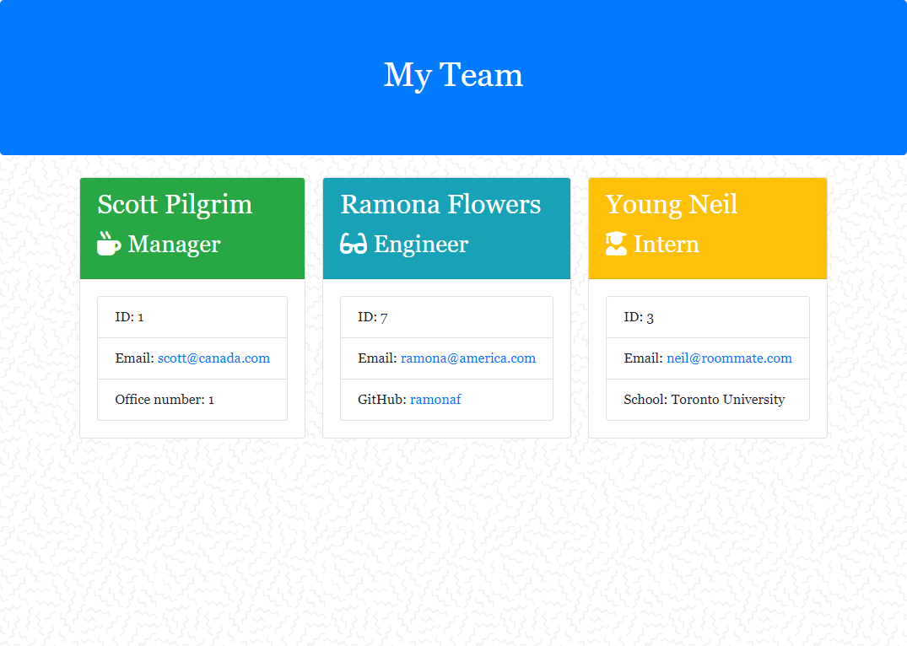

[](https://opensource.org/licenses/MIT)
# The Team Profile Generator

## Description

The Team Profile Generator is a command line interface that was built through Test Driven Development and uses javascript and Node.js to dynamically create an aesthetically satisfying team-page for software engineering teams based on the data input by its user. 

## Table of Contents

* [Installation](#installation)
* [Usage](#usage)
* [Credits](#credits)
* [License](#license)


## Installation

Begin by forking the repository and downloading to your computer and make sure that you have node already installed. You may need to run 
```npm init``` or ```npm install``` but no other files should be necessary.

## Usage

To use the application, navigate into the repository in your terminal and run the following command:

``` node app.js ```

Answer the prompts as they appear in your terminal. After each employee has been added, you will have the option to finish or add another. There can only be one manager, but you can add as many engineers and interns as you would like. Once you have finished answering, a log should appear reading "Team page has been built". This new completed html page can be found under the 'output' folder in the file.



For a video demo of the application in action, please click the link below.

[Demonstration Video](https://drive.google.com/file/d/1iD6sOPrRye-4PAzxWBeYHoQJ8oEYWydD/view).

## Tests

To test the methods built, feel free to run ```npm run test```.

## Credits

Thanks to the teaching staff and my fellow classmates!
## License

MIT License

Copyright (c) 2021 Spencer Vaughan

Permission is hereby granted, free of charge, to any person obtaining a copy
of this software and associated documentation files (the "Software"), to deal
in the Software without restriction, including without limitation the rights
to use, copy, modify, merge, publish, distribute, sublicense, and/or sell
copies of the Software, and to permit persons to whom the Software is
furnished to do so, subject to the following conditions:

The above copyright notice and this permission notice shall be included in all
copies or substantial portions of the Software.

THE SOFTWARE IS PROVIDED "AS IS", WITHOUT WARRANTY OF ANY KIND, EXPRESS OR
IMPLIED, INCLUDING BUT NOT LIMITED TO THE WARRANTIES OF MERCHANTABILITY,
FITNESS FOR A PARTICULAR PURPOSE AND NONINFRINGEMENT. IN NO EVENT SHALL THE
AUTHORS OR COPYRIGHT HOLDERS BE LIABLE FOR ANY CLAIM, DAMAGES OR OTHER
LIABILITY, WHETHER IN AN ACTION OF CONTRACT, TORT OR OTHERWISE, ARISING FROM,
OUT OF OR IN CONNECTION WITH THE SOFTWARE OR THE USE OR OTHER DEALINGS IN THE
SOFTWARE.

